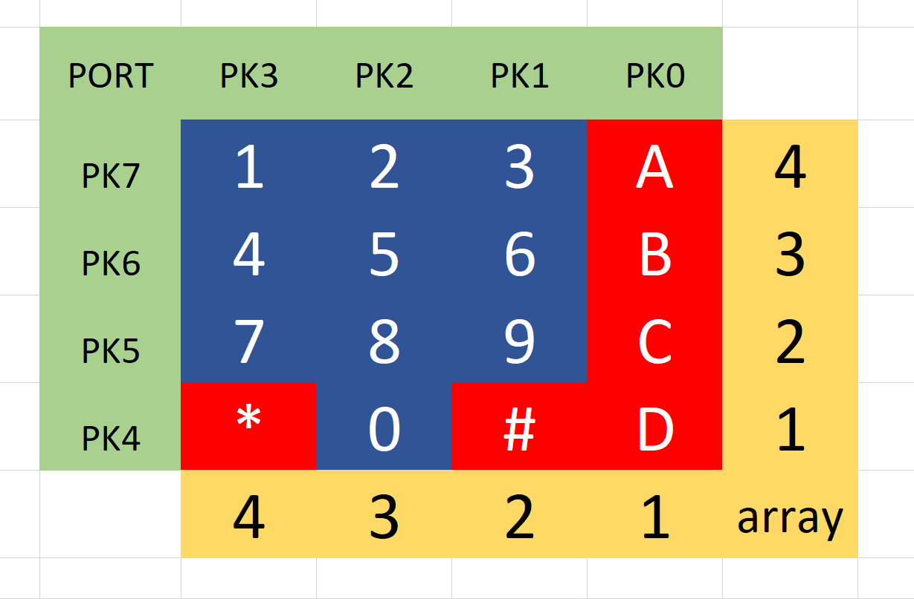
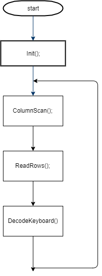
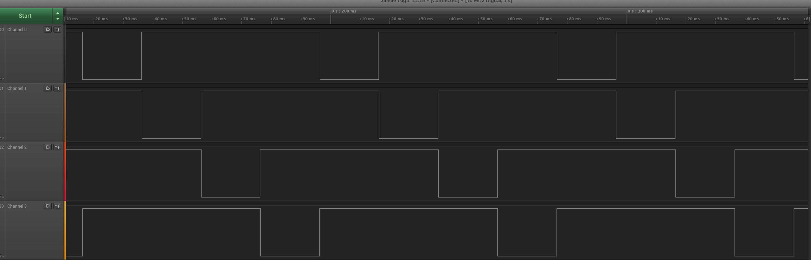

# Keypads projekt

Keypadx is a projekt , where we try to read the signal from a Keypad to an Adorino.
For a verification of our program we used Tera as means to see the output of our program

# Diagram

# Starting point :

# flowshart

- WE have to set 4 Port to Input and 4 to Output with the help of an Init() function 
- Creating a ColumnScan() function to read the Output in a sequence interval
- Creating a ReadRows() function to check if the Input active
- Creating a DecodeKeyboard() function with 2 parametes , as wish with a hælp of an array to find out what have to be write on our tera/terminal

# resultate af Logic analyzer

