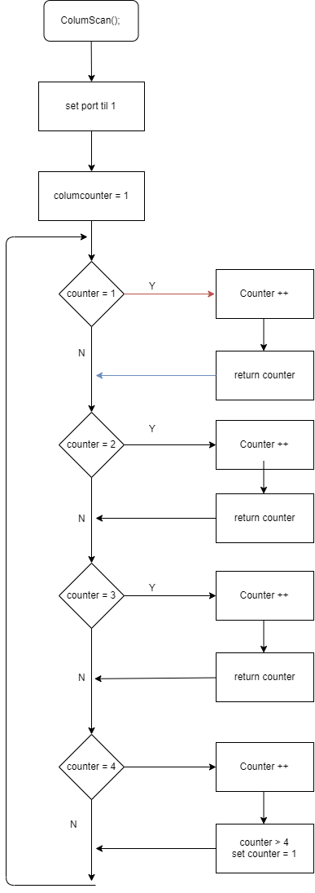
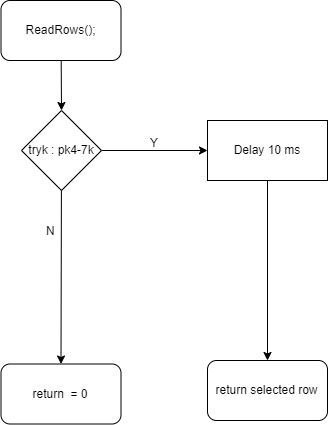
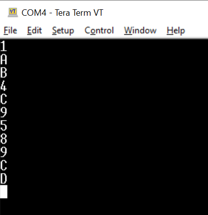

# Keypads projekt

Keypadx is a projekt , where we try to read the signal from a Keypad to an Adorino.
For a verification of our program we used Tera as means to see the output of our program

# Diagram

here are the Port and array logic that i will be using for my program.
you can always change it to other port or use the array to have other output result.

# flowshart

  

   

# Starting point :

- WE have to set 4 Port to Input and 4 to Output with the help of an Init() function 
- Creating a ColumnScan() function to read the Output in a sequence interval
- Creating a ReadRows() function to check if the Input active
- Creating a DecodeKeyboard() function with 2 parametes , as wish with a hælp of an array to find out what have to be write on our tera/terminal

# resultate af Logic analyzer

To check if the ColumnScan() function is working correctly we used a  logic analyzer to see if we have the  right output

# Display on tera

If the projekt is working correctly we will be able to see the result on the Tera program as follow when  we click the botton

