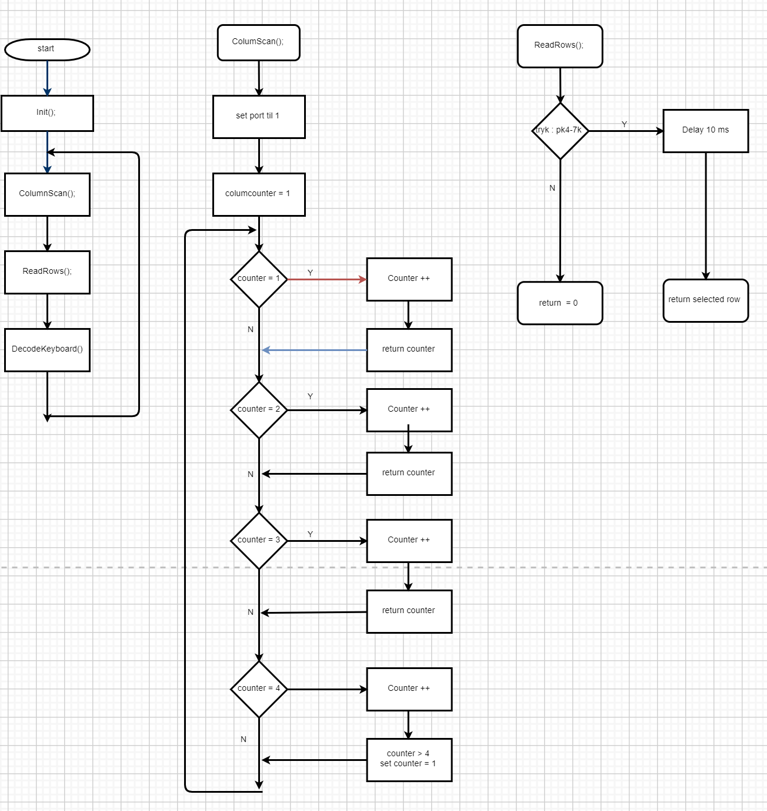

# Keypads projekt

Keypadx er en program som kan læsse signal fra en keypad til en adorino, hvad hjælp af de signal fra porten

startet punkt :

- Åbne 4 port og set 4 port til pull-up hvad hjælp af Init() function
- Opret af ColumScan() function som scanner for column om de er logic 1
- Opret af ReadRows() fimctopm som check om rows er logic 1
- Opret af DecodeKeyboard() some motage 2 paramet og ved hjælp af en array udregn hvad der skal blive skrive ud

# resultate af Logic analyzer

# Diagram

# flowshart

